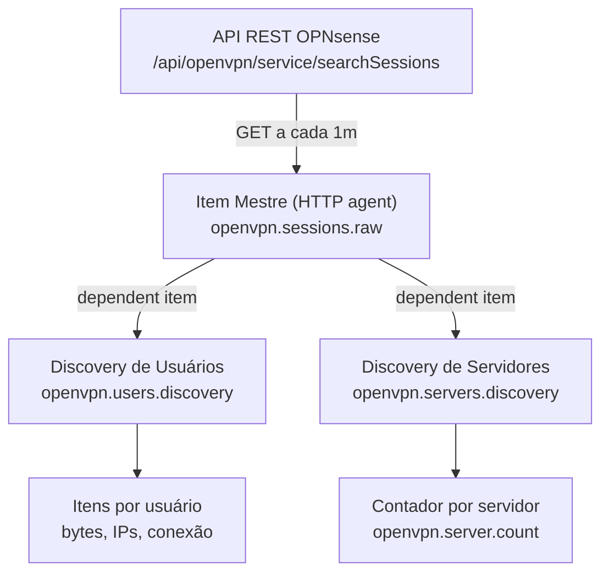

# Monitoramento de Sessões OpenVPN — OPNsense + Zabbix via API REST

> Documentação técnica de implantação do monitoramento das sessões OpenVPN de um firewall **OPNsense** no **Zabbix**, usando a **API REST** do OPNsense como fonte de dados.


---

## 📑 Sumário

- [1. Visão Geral](#1-visão-geral)
  - [1.1. Objetivo](#11-objetivo)
  - [1.2. Arquitetura da solução](#12-arquitetura-da-solução)
  - [1.3. Pré-requisitos](#13-pré-requisitos)
- [2. Preparação no OPNsense](#2-preparação-no-opnsense)
  - [2.1. Criação do usuário e chave de API](#21-criação-do-usuário-e-chave-de-api)
  - [2.2. Identificação da porta e liberação de acesso](#22-identificação-da-porta-e-liberação-de-acesso)
  - [2.3. Validação do endpoint da API](#23-validação-do-endpoint-da-api)
- [3. Item Mestre (HTTP agent)](#3-item-mestre-http-agent)
  - [3.1. Configuração do item](#31-configuração-do-item)
  - [3.2. Teste do item](#32-teste-do-item)
- [4. Discovery de Usuários](#4-discovery-de-usuários)
  - [4.1. Regra de descoberta (LLD)](#41-regra-de-descoberta-lld)
  - [4.2. Protótipos de item (por usuário)](#42-protótipos-de-item-por-usuário)
  - [4.3. Validação](#43-validação)
- [5. Discovery de Servidores (Contador de Usuários)](#5-discovery-de-servidores-contador-de-usuários)
  - [5.1. Regra de descoberta (LLD)](#51-regra-de-descoberta-lld)
  - [5.2. Protótipo de item — Contador por servidor](#52-protótipo-de-item--contador-por-servidor)
  - [5.3. Validação](#53-validação)
- [6. Alertas (Triggers) — Opcional](#6-alertas-triggers--opcional)
- [7. Resolução de Problemas (Troubleshooting)](#7-resolução-de-problemas-troubleshooting)
- [8. Resumo dos Objetos Criados](#8-resumo-dos-objetos-criados)

---

## 1. Visão Geral

Este documento descreve a implantação do monitoramento das sessões OpenVPN de um firewall OPNsense no Zabbix, utilizando a API REST do OPNsense como fonte de dados. A solução coleta, para cada usuário conectado, informações como tráfego recebido e enviado, endereço IP virtual e real e horário de conexão, além de um contador de usuários conectados por servidor VPN.

**Resultado a ser alcançado:**


### 1.1. Objetivo

- Monitorar individualmente cada usuário conectado às VPNs OpenVPN.
- Contar quantos usuários estão conectados em cada servidor VPN (ex.: `Usuários Conectados VPN-SERVER-TI: 10`).
- Permitir a criação de alertas (triggers) e painéis a partir desses dados.

### 1.2. Arquitetura da solução

A coleta é feita por um único **item mestre** (HTTP agent) que consulta a API do OPNsense e armazena o JSON completo das sessões. A partir dele, dois mecanismos de **descoberta de baixo nível (LLD)** e seus itens dependentes extraem os dados:

- **Item mestre:** faz a chamada à API e guarda o JSON cru.
- **Discovery de usuários:** cria um conjunto de itens por usuário conectado.
- **Discovery de servidores:** cria um contador de usuários conectados por servidor VPN.



> [!NOTE]
> Todos os itens de usuário e de servidor são **itens dependentes** do mesmo item mestre. Assim, a API é consultada **uma única vez por ciclo**, e todo o processamento acontece dentro do Zabbix via pré-processamento.

### 1.3. Pré-requisitos

| Pré-requisito | Descrição |
|---|---|
| **OPNsense** | Acesso administrativo e API habilitada. |
| **Chave de API** | Par `key`/`secret` de um usuário com privilégio mínimo **Status: OpenVPN**. |
| **Conectividade** | Servidor Zabbix deve alcançar o OPNsense na porta do GUI/API (ex.: `5070/TCP`). |
| **Zabbix** | Versão com suporte a JSONPath com filtro `?()` e pré-processamento JavaScript (5.4+). |

---

## 2. Preparação no OPNsense

### 2.1. Criação do usuário e chave de API

Acesse **System → Access → Users**, edite (ou crie) um usuário dedicado ao monitoramento e gere um par de chaves de API na seção *API keys*. Faça o download do arquivo contendo `key` e `secret`.

1. Defina os privilégios do usuário como **Status: OpenVPN** (permissão mínima de leitura).
2. Evite deixar o usuário no grupo `admins` ou com privilégio *All pages*.
3. Gere a chave de API e guarde o arquivo com `key` e `secret` em local seguro.

> **📷 Relato:** Na primeira tentativa o usuário foi criado com *All pages* / grupo `admins` — privilégio excessivo para monitoramento. O correto é restringir a **Status: OpenVPN**, como mostrado abaixo.

**Tela de edição do usuário:**


**Chave de API gerada e privilégio restrito a OpenVPN:**


**Privilégio Status OpenVPN:**


### 2.2. Identificação da porta e liberação de acesso

A interface administrativa e a API do OPNsense respondem na **mesma porta**. Neste ambiente, a porta utilizada é a **`5070`** (ex.: `https://192.168.0.2:5070`).

> **📷 Relato:** As portas padrão (443/80) estavam filtradas para a estação — só o `ping` respondia. A varredura de portas revelou que o GUI/API respondia na porta **5070** (`https://192.168.0.2:5070/ui/core/dashboard`). Esse foi o ponto que destravou toda a validação.

Garanta que o servidor Zabbix tenha acesso de rede ao OPNsense nessa porta, criando uma regra de firewall se necessário:

| Parâmetro | Valor |
|---|---|
| **Origem** | IP do servidor Zabbix |
| **Destino** | This Firewall (IP do OPNsense) |
| **Protocolo / Porta** | `TCP` / `5070` (porta do GUI/API) |

> 📷 **Print pendente:** *Regra de firewall liberando o acesso do Zabbix à API.*

### 2.3. Validação do endpoint da API

Antes de configurar o Zabbix, valide o endpoint com um cliente HTTP (curl ou Postman), usando autenticação **Basic** (key no usuário, secret na senha) e **ignorando a verificação de certificado** (certificado autoassinado).

**Endpoint utilizado:**

```http
GET https://192.168.0.2:5070/api/openvpn/service/searchSessions
```

**Exemplo com curl:**

```bash
curl -k -u "SUA_KEY:SEU_SECRET" \
  https://192.168.0.2:5070/api/openvpn/service/searchSessions
```

O retorno esperado é um **JSON com status 200** contendo o array de sessões. Cada sessão de usuário possui os campos utilizados no monitoramento:

| Campo do JSON | Uso no Zabbix |
|---|---|
| `common_name` | Nome do usuário conectado |
| `description` | Nome do servidor VPN |
| `client_id` | Identificador único da sessão (chave dos itens) |
| `bytes_received` | Tráfego recebido |
| `bytes_sent` | Tráfego enviado |
| `virtual_address` | IP virtual atribuído |
| `real_address` | IP real de origem |
| `connected_since__time_t_` | Horário de conexão (timestamp Unix) |

> [!NOTE]
> Linhas de servidores sem ninguém conectado aparecem no JSON com `common_name` e `client_id` **nulos**. Elas são descartadas pelos filtros do discovery de usuários e contadas como **zero** no discovery de servidores.

**Resposta 200 OK no Postman:**


**JSON das sessões retornado:**


---

## 3. Item Mestre (HTTP agent)

O item mestre é o único que efetivamente consulta a API. Ele armazena o JSON completo, que é consumido por todos os itens dependentes. Recomenda-se criá-lo em um **template** (ex.: `OPNSense API`) vinculado ao host do firewall.

### 3.1. Configuração do item

| Campo | Valor |
|---|---|
| **Name** | `OpenVPN Sessions - raw` |
| **Type** | HTTP agent |
| **Key** | `openvpn.sessions.raw` |
| **URL** | `https://<IP>:<PORTA>/api/openvpn/service/searchSessions` |
| **Request type** | GET |
| **HTTP authentication** | Basic |
| **User name** | `{$OPNSENSE.KEY}` |
| **Password** | `{$OPNSENSE.SECRET}` |
| **SSL verify peer** | Desmarcado |
| **SSL verify host** | Desmarcado |
| **Type of information** | Text |
| **Update interval** | `1m` |

> [!IMPORTANT]
> Use **macros de usuário** para armazenar a credencial com segurança: crie `{$OPNSENSE.KEY}` e `{$OPNSENSE.SECRET}` nas macros do host (marcando o secret como *Secret text*). A sintaxe de macro **exige o cifrão**: `{$OPNSENSE.KEY}` — e **não** `{OPNSENSE.KEY}`.

**Configuração do item mestre:**


### 3.2. Teste do item

Use o botão **Test → Get value and test** no host. O resultado esperado é o JSON das sessões (ex.: começando por `{"total":NN,"rowCount":NN,...}`). Um erro **401** indica credencial incorreta (verifique o tipo Basic e o cifrão nas macros).

> **📷 Relato:** O primeiro teste retornou `401 Authentication Failed` porque as macros foram escritas **sem o cifrão** (`{OPNSENSE.KEY}`) e ainda não existiam no host. Após criar as macros com `{$...}` e selecionar *HTTP authentication = Basic*, o item passou a retornar o JSON (200).


---

## 4. Discovery de Usuários

Esta regra de descoberta percorre o array de sessões e cria, para cada usuário conectado, um conjunto de itens dependentes.

### 4.1. Regra de descoberta (LLD)

| Campo | Valor |
|---|---|
| **Name** | `OpenVPN Users Discovery` |
| **Type** | Dependent item |
| **Key** | `openvpn.users.discovery` |
| **Master item** | `OpenVPN Sessions - raw` |
| **Delete lost resources** | After 7d (ou Immediately) |
| **Disable lost resources** | Immediately |


#### Pré-processamento

Passo único do tipo **JSONPath**:

```text
$.rows
```


#### Macros LLD

| Macro LLD | JSONPath |
|---|---|
| `{#CLIENT_ID}` | `$.client_id` |
| `{#COMMON_NAME}` | `$.common_name` |
| `{#DESCRIPTION}` | `$.description` |
| `{#VIRTUAL_ADDRESS}` | `$.virtual_address` |


#### Filtros (tipo de cálculo: And/Or)

| Macro | Condição / Expressão |
|---|---|
| `{#CLIENT_ID}` | `matches` &nbsp; `^[0-9]+$` |
| `{#COMMON_NAME}` | `matches` &nbsp; `.+` |


> [!WARNING]
> O filtro por `{#CLIENT_ID}` com a expressão `^[0-9]+$` é o que **impede a criação de itens inválidos com `[null]`** a partir das linhas de servidor sem usuário. Ele é essencial.

> **📷 Relato:** Sem esse filtro, o discovery tentava criar itens com a key `...[null]` (três linhas de servidor com `client_id` nulo colidiam na mesma key), gerando o erro *"item with the same key already exists"*. O filtro `^[0-9]+$` resolveu de forma definitiva.


### 4.2. Protótipos de item (por usuário)

Todos são itens **dependentes** do item mestre `OpenVPN Sessions - raw`, com um passo de pré-processamento JSONPath que isola o registro do usuário pelo `client_id`.

> [!TIP]
> Digite as chaves **manualmente** (sem colar) e **sem ponto antes do colchete**. Um caractere invisível ao colar, ou um `.` antes do `[`, causa o erro *"incorrect syntax near"* ou keys do tipo `bytes_received.[null]`.

#### Protótipo 1 — Bytes recebidos

| Campo | Valor |
|---|---|
| **Name** | `[{#DESCRIPTION}] {#COMMON_NAME} - Bytes recebidos` |
| **Key** | `openvpn.user.bytes_received[{#CLIENT_ID}]` |
| **Type of information** | Numeric (unsigned) |
| **Units** | `B` |

**Pré-processamento (JSONPath):**

```text
$.rows[?(@.client_id == '{#CLIENT_ID}')].bytes_received.first()
```


#### Protótipo 2 — Bytes enviados

| Campo | Valor |
|---|---|
| **Name** | `[{#DESCRIPTION}] {#COMMON_NAME} - Bytes enviados` |
| **Key** | `openvpn.user.bytes_sent[{#CLIENT_ID}]` |
| **Type of information** | Numeric (unsigned) |
| **Units** | `B` |

**Pré-processamento (JSONPath):**

```text
$.rows[?(@.client_id == '{#CLIENT_ID}')].bytes_sent.first()
```


#### Protótipo 3 — IP virtual

| Campo | Valor |
|---|---|
| **Name** | `[{#DESCRIPTION}] {#COMMON_NAME} - IP virtual` |
| **Key** | `openvpn.user.virtual_address[{#CLIENT_ID}]` |
| **Type of information** | Character |

**Pré-processamento (JSONPath):**

```text
$.rows[?(@.client_id == '{#CLIENT_ID}')].virtual_address.first()
```


#### Protótipo 4 — IP real

| Campo | Valor |
|---|---|
| **Name** | `[{#DESCRIPTION}] {#COMMON_NAME} - IP real` |
| **Key** | `openvpn.user.real_address[{#CLIENT_ID}]` |
| **Type of information** | Character |

**Pré-processamento (JSONPath):**

```text
$.rows[?(@.client_id == '{#CLIENT_ID}')].real_address.first()
```


#### Protótipo 5 — Conectado desde

| Campo | Valor |
|---|---|
| **Name** | `[{#DESCRIPTION}] {#COMMON_NAME} - Conectado desde` |
| **Key** | `openvpn.user.connected_since[{#CLIENT_ID}]` |
| **Type of information** | Numeric (unsigned) |
| **Units** | `unixtime` |

**Pré-processamento (JSONPath):**

```text
$.rows[?(@.client_id == '{#CLIENT_ID}')].connected_since__time_t_.first()
```

> [!NOTE]
> O campo `connected_since__time_t_` possui **dois underscores** no final. Com a unidade `unixtime`, o Zabbix exibe a data de forma legível automaticamente.


### 4.3. Validação

Execute a regra (**Execute now**) e verifique em **Latest data**, filtrando pelo nome de um usuário. Devem aparecer os itens com valores reais (tráfego, IPs, data de conexão).

> **📷 Relato:** Ao filtrar por *"OpenVPN"* em Latest data, só o item mestre aparecia — o que dava a falsa impressão de que nada havia sido coletado. Os itens por usuário têm nome começando por `[VPN-SERVER-...]`, então foi preciso filtrar por `Bytes recebidos` (ou pelo nome do usuário) para que aparecessem os 15 itens.


---

## 5. Discovery de Servidores (Contador de Usuários)

Esta regra descobre os servidores VPN distintos e cria, para cada um, um **contador de usuários conectados**. Como o mesmo servidor aparece várias vezes no JSON (uma por usuário), é necessário **deduplicar** os servidores no pré-processamento com JavaScript.

### 5.1. Regra de descoberta (LLD)

| Campo | Valor |
|---|---|
| **Name** | `OpenVPN Servers Discovery` |
| **Type** | Dependent item |
| **Key** | `openvpn.servers.discovery` |
| **Master item** | `OpenVPN Sessions - raw` |
| **Delete lost resources** | Immediately (ou After) |


#### Pré-processamento (JavaScript) — deduplicação dos servidores

```javascript
var rows = JSON.parse(value).rows;
var seen = {};
var out = [];
rows.forEach(function(r) {
  if (r.description && !seen[r.description]) {
    seen[r.description] = true;
    out.push({ "SERVER": r.description });
  }
});
return JSON.stringify(out);
```


#### Macros LLD

| Macro LLD | JSONPath |
|---|---|
| `{#SERVER}` | `$.SERVER` |


> [!NOTE]
> O pré-processamento JavaScript, o mapeamento da macro (`$.SERVER`) e o filtro precisam ser **coerentes entre si**. Como o script já devolve apenas servidores válidos, o filtro pode ser mantido simples (`{#SERVER} matches .+`) ou removido.

> **📷 Relato:** Houve um erro *"Cannot accurately apply filter: no value received for macro `{#SERVER}`"* quando o pré-processamento, a macro LLD e o filtro ficaram desencontrados. A correção foi padronizar a chave do objeto como `SERVER` no JavaScript, mapear a macro como `$.SERVER` e manter o filtro simples.


### 5.2. Protótipo de item — Contador por servidor

| Campo | Valor |
|---|---|
| **Name** | `Usuários Conectados {#SERVER}` |
| **Type** | Dependent item |
| **Key** | `openvpn.server.count[{#SERVER}]` |
| **Master item** | `OpenVPN Sessions - raw` |
| **Type of information** | Numeric (unsigned) |


#### Pré-processamento (JavaScript) — contagem de usuários

```javascript
var rows = JSON.parse(value).rows;
var count = 0;
rows.forEach(function(r) {
  if (r.description === '{#SERVER}' && r.common_name) {
    count++;
  }
});
return count;
```

> [!NOTE]
> A contagem foi feita em **JavaScript** (e não em JSONPath com `.length()`) para garantir compatibilidade entre versões do Zabbix e para contar **apenas sessões com usuário real** (`common_name` preenchido). Servidores sem ninguém conectado retornam **0**.


### 5.3. Validação

Execute a regra (**Execute now**) e verifique em **Latest data**, filtrando por *"Usuários Conectados"*. Cada servidor deve exibir o número de conectados; servidores vazios exibem **0**. A soma dos contadores deve corresponder ao total de usuários reais conectados.

> **📷 Relato:** Resultado final validado — `ARGOFRUTA: 8`, `RESULTE: 5`, `TI: 1`, `WISEDB: 1` e os servidores vazios (`DOLE`, `FUSION`, `MTS`) em `0`. Soma = **15**, exatamente o total de usuários reais no JSON.


---

## 6. Alertas (Triggers) — Opcional

A partir do contador por servidor e dos itens de usuário, é possível criar triggers. Abaixo, exemplos de expressões (ajuste nomes de host, chaves e limites ao seu ambiente).

**Servidor sem usuários conectados:**

```text
last(/OPNSense Firewall/openvpn.server.count[VPN-SERVER-TI])=0
```

**Limite de usuários excedido em um servidor:**

```text
last(/OPNSense Firewall/openvpn.server.count[VPN-SERVER-ARGOFRUTA])>50
```

**Consumo de banda elevado de um usuário (exemplo via protótipo):**

```text
last(/OPNSense Firewall/openvpn.user.bytes_received[{#CLIENT_ID}])>1073741824
```

> [!NOTE]
> Esta seção é opcional e pode ser ajustada conforme a necessidade de alertas do ambiente.

---

## 7. Resolução de Problemas (Troubleshooting)

| Sintoma / Erro | Causa provável e solução |
|---|---|
| `timeout` / `401` (API) | Verifique porta correta (`5070`), autenticação Basic e cifrão nas macros `{$...}`. |
| `Request timed out` (curl/Postman) | Problema de rede/firewall. Confirme a porta do GUI (ex.: `5070`) e libere o acesso. |
| `401 Authentication Failed` no Zabbix | HTTP authentication deve ser **Basic**; key no *User name* e secret no *Password*; macros com cifrão `{$OPNSENSE.KEY}`. |
| `incorrect syntax near ...` na key | Caractere invisível ou ponto antes do colchete. Redigite a key manualmente: `openvpn.user.X[{#CLIENT_ID}]`. |
| `item with the same key [null] already exists` | Filtro insuficiente. Adicione filtro `{#CLIENT_ID} matches ^[0-9]+$` na regra de discovery. |
| `no value received for macro {#SERVER}` | Incoerência entre pré-proc., macro LLD e filtro. Alinhe JavaScript (`SERVER`) + macro `$.SERVER`. |
| Contador criado mas sem valor | Expressão de contagem inválida. Use o passo **JavaScript** de contagem (seção 5.2). |
| Itens não aparecem em Latest data | Filtro de visualização escondendo. Filtre pelo nome do item/usuário e rode **Execute now**. |
| Botão **Test** desabilitado | Você está no template. Teste pelo **host** (Hosts → Discovery rules → Test). |

---

## 8. Resumo dos Objetos Criados

Referência rápida de todas as chaves criadas no Zabbix.

| Objeto / Chave | Descrição |
|---|---|
| `openvpn.sessions.raw` | Item mestre HTTP agent (JSON das sessões) |
| `openvpn.users.discovery` | Regra LLD de usuários |
| `openvpn.user.bytes_received[{#CLIENT_ID}]` | Bytes recebidos por usuário |
| `openvpn.user.bytes_sent[{#CLIENT_ID}]` | Bytes enviados por usuário |
| `openvpn.user.virtual_address[{#CLIENT_ID}]` | IP virtual por usuário |
| `openvpn.user.real_address[{#CLIENT_ID}]` | IP real por usuário |
| `openvpn.user.connected_since[{#CLIENT_ID}]` | Horário de conexão por usuário |
| `openvpn.servers.discovery` | Regra LLD de servidores |
| `openvpn.server.count[{#SERVER}]` | Contador de usuários por servidor |

**Macros de usuário:**

- `{$OPNSENSE.KEY}` — chave da API.
- `{$OPNSENSE.SECRET}` — segredo da API (marcar como *Secret text*).

---

<div align="center">
<sub>Documentação técnica de implantação · Monitoramento OpenVPN (OPNsense + Zabbix) · v1.0</sub>
</div>
